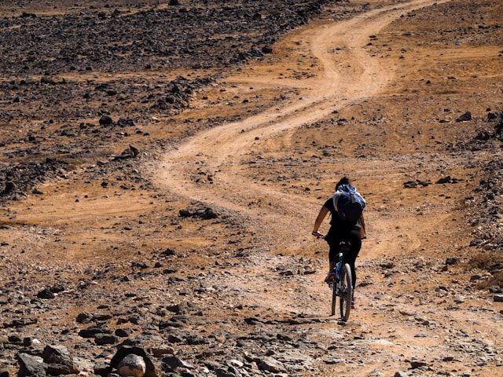

Photo by [Edoardo Frezet](https://unsplash.com/@edoardofrezet?utm_content=creditCopyText&utm_medium=referral&utm_source=unsplash) on [Unsplash](https://unsplash.com/photos/man-in-black-jacket-riding-bicycle-on-brown-sand-during-daytime-AQzYACw9TtA?utm_content=creditCopyText&utm_medium=referral&utm_source=unsplash)

# Why a Gravel Bike Is the Only Commuter Bike You’ll Ever Need

Choosing the right bike for commuting is like choosing the right coffee: you think it’s simple until you’re confronted with 57 options, half of which sound like they were named by a committee of overly enthusiastic marketing interns. 

But here’s the thing: **you don’t need 57 options. You need one.**  
And that one is a **gravel bike.**  
Not a hybrid, not a road bike, and certainly not whatever futuristic folding contraption your coworker insists "fits perfectly under their desk." No, thank you.

Allow me to explain why the gravel bike isn’t just a good choice—it’s **the only choice** for commuters with actual places to be, things to carry, and the occasional desire to detour down a questionable side road just to see where it goes.

---

## 1. Versatility: The Swiss Army Knife of Bikes (But Cooler)

Imagine a bike that doesn’t care where you ride it. Tarmac? Sure. Gravel paths? Absolutely. Cobblestones left over from the 18th century? Bring it on. That mysterious shortcut through the park that’s *probably* not technically legal but shaves off five minutes? No problem.

- **Gravel bikes are designed to handle everything.**  
  Potholes? Mere suggestions.  
  Wet leaves? Nature’s confetti.  
  That dirt path your GPS insists is a road? Adventure.

While road bikes tremble at the sight of uneven surfaces and hybrids have an identity crisis halfway through a commute, **gravel bikes thrive on unpredictability.** Which is great, because commuting is often exactly that.

---

## 2. Comfort: Because Your Spine Deserves Better

Road bikes are fast, yes—but they achieve that speed by making you hunch over like you’re trying to fold yourself into an origami crane. Hybrids, on the other hand, are upright but often feel like riding a sofa on wheels (and not in a good way).

**Gravel bikes? The Goldilocks of comfort.**

- **Relaxed Geometry:** More upright than a road bike, but still aerodynamic enough to make you feel fast.  
- **Wider Tires:** More cushioning, less vibration, and a significantly reduced chance of feeling like your teeth are trying to escape your face on bumpy roads.  
- **Multiple Hand Positions:** Thanks to drop bars, you can shift your grip, avoiding that dreaded "claw hand" sensation after long rides.

In short: **fast without the back pain, comfortable without the sluggishness.**

---

## 3. Speed: Yes, Gravel Bikes Are Fast (Stop Arguing)

"Gravel bikes aren’t as fast as road bikes," they say.  
To which I reply: **"How much time are you really saving when your road bike can’t handle the shortcut through the park?"**

Gravel bikes might not win the Tour de France, but unless your commute is literally a race, **they’re plenty fast.**

- On smooth roads? Fast.  
- On rough roads? Still fast.  
- On surfaces where road bikes cry and hybrids give up? **Guess what—still fast.**

And unlike road bikes, you won’t have to slow down every time you see a crack in the pavement, a suspicious puddle, or a rogue squirrel plotting your downfall.

---

## 4. Practicality: You Can Actually Carry Stuff

Let’s talk about **cargo.** You’ve got a laptop, lunch, maybe a change of clothes, and the occasional existential crisis to haul around. Road bikes? Good luck balancing that with a tiny saddlebag and a prayer.

**Gravel bikes come prepared:**

- **Rack and Fender Mounts:** Attach bags, panniers, or even a full touring setup if you’re feeling dramatic.  
- **Tire Clearance:** Wide enough for stability even when fully loaded, unlike road bikes that panic under the weight of a banana.  
- **Adventure-Ready:** Because sometimes your "commute" turns into "accidentally cycling 20 km further than planned because the weather was nice."

---

## 5. Low Maintenance: Because You Have Better Things to Do

Gravel bikes are like that reliable friend who shows up on time, doesn’t overcomplicate things, and never asks you to help them move.

- **Simple Drivetrains:** Fewer things to go wrong, which is exactly what you want when it’s 8 AM and you’re already late.  
- **Disc Brakes:** Stop reliably in rain, mud, or during sudden encounters with pigeons who refuse to yield.  
- **Durability:** Built to handle rough conditions, so they laugh in the face of potholes and scoff at the idea of "fragile components."

Translation? **Less time fixing things, more time riding.**

---

## A Day in the Life of a Gravel Bike Commuter

You leave home a little late. No worries. Your gravel bike eats up the smooth roads with ease.

Traffic jam ahead? Not a problem—you slip onto that gravel path running parallel to the main road. It’s technically not part of your route, but your bike doesn’t mind.

Unexpected rainstorm? Disc brakes keep you in control, and your wider tires grip like a gecko in hiking boots.

Need to pick up groceries on the way home? You’ve got racks. You’ve got bags. You’ve got options.

And when the weekend comes around? **It’s not just a commuter bike anymore.**  
It’s your adventure buddy.

---

## Gravel vs. Road vs. Hybrid: The Unbiased (But Totally Biased) Chart

| **Feature**           | **Road Bike 🚴‍♂️**               | **Hybrid 🚲**                        | **Gravel Bike 🌍 (The Winner)**         |
|-----------------------|----------------------------------|-------------------------------------|-----------------------------------------|
| **Speed**             | Fast on perfect roads            | Moderate, feels like effort         | Fast everywhere, no excuses             |
| **Comfort**           | Aggressive posture               | Upright, but sluggish               | Relaxed, but still efficient            |
| **Terrain**           | Paved roads only                 | Light off-road (barely)             | Anything short of lava                  |
| **Cargo Capacity**    | Minimal (hope you packed light)  | Okay, if you don’t mind wobbling    | Racks, bags, the whole works            |
| **Maintenance**       | High-maintenance diva            | Depends on the bike                 | Low-maintenance legend                  |
| **Weekend Fun**       | Fast rides, no detours allowed   | None, because you’re bored          | Bikepacking, gravel adventures, freedom |

---

## Final Thoughts (Because You’re Almost Convinced Anyway)

If your idea of commuting is limited to smooth roads and predictable weather, sure—get a road bike.  
If you enjoy pedaling a sofa that goes nowhere fast, a hybrid is waiting for you at the back of the bike shop.  
**But if you want freedom, versatility, comfort, speed, and a bike that can handle anything life throws at it—get a gravel bike.**  

Trust me. Your future self will thank you. Probably with snacks.

---

*Disagree? Think your fixie with no brakes is the pinnacle of cycling efficiency? Feel free to share your thoughts—just try not to get overtaken by a gravel bike on your next commute.*